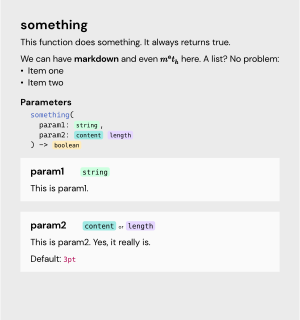

# Typst-Doc
*A doctor for your documentation*

[](https://github.com/Mc-Zen/typst-doc/actions/workflows/run_tests.yml)

**typst-doc** is a package that generates documentation directly in [Typst](https://typst.app/) for your Typst modules. It parses docstring comments similar to javadoc and co. and can be used to easily build a beautiful reference section for the parsed module.  

Within the docstring you may use any Typst syntax - so markup, equations and even figures are no problem!

Features:
- Annotate types of parameters and return values.
- Read off default values for named parameters.
- Function description.
- Parameter descriptions.
- Display function signature (with types).


The [documentation](./docs/typst-doc.pdf) describes the usage of this module and the defined format for the docstrings. 

## Setup

Since there is no package manager for Typst yet, in order to use this library, download the [typst-doc.typ](./typst-doc.typ) file and place it in your Typst project. 

## Example

A full example on how to use this module for your own package (maybe even consisting of multiple files) can be found at [examples](../examples/).

Feed **typst-doc** your in-code documented source files and get beautiful documentation of all your functions printed out. Enjoy features like type annotations, links to other documented functions and arbitrary formatting within function and parameter descriptions. Let's get started.

You can document your functions similar to javadoc by prepending a block of `///` comments. 


 ```java
/// This function does something. It always returns true.
///
/// We can have *markdown* and 
/// even $m^a t_h$ here. A list? No problem:
///  - Item one 
///  - Item two 
///
///
/// - param1 (string): This is param1.
/// - param2 (content, length): This is param2.
///           Yes, it really is. 
/// -> boolean
#let something(param1, param2: 3pt) = { return true }
```

**typst-doc** turns this into (without the gray background):


